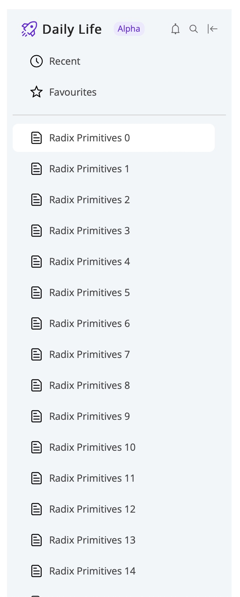
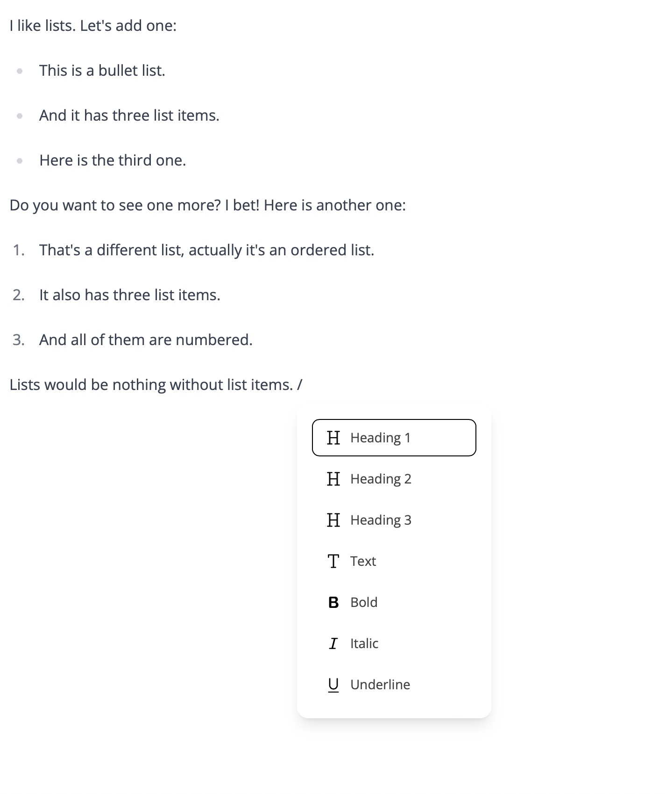

# Loop
An attempt to replicate Microsoft Loop front end.
The goal of this project was to try to understand how (https://www.microsoft.com/en-us/microsoft-loop)[Microsoft Loop] was designed and implemented in terms of UI.

Sidebar component:


Rich Text Editor with Slash Menu:


We can also see that the loss is very noisy. Not every impressive, but it works! Yay?

## Requirements
- Node v20.3.1.
- Bun.sh.

## Getting Started
Install dependencies:
```
$ bun install
```
Run storybook:
```
$ bun run storybook
```
